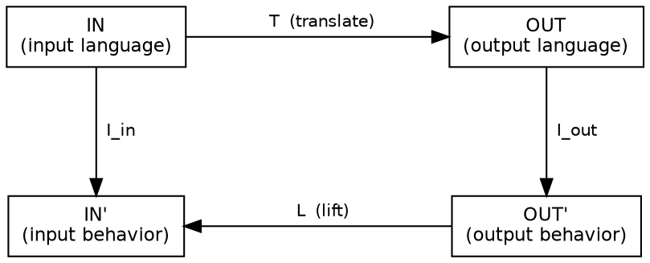
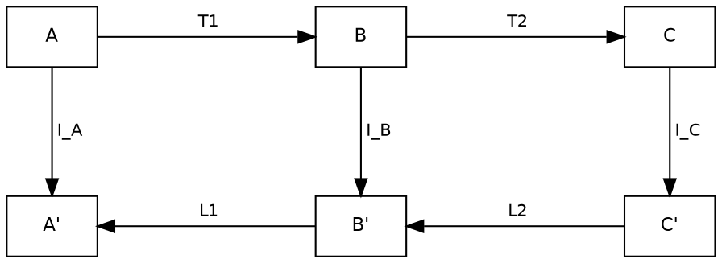

# Design note — generalizing pairs to arbitrary formal-language translations

*Status: proposal (recorded 2026-06-04). This note records a direction and
its trade-offs; **nothing here is committed**. It exists so the idea — and
the reasons for and against it — are on disk before any machinery is built.
The concrete first step is specified separately in
[`DESIGN_c_to_btor2_chain.md`](./DESIGN_c_to_btor2_chain.md); build and
validate that one chain before generalizing any framework code. Like
[`DESIGN_certificate_module_sharing.md`](./DESIGN_certificate_module_sharing.md),
this is demand-driven: the abstraction lands when a concrete consumer needs
it, not before.*

## 1. The whole proposal is one move

Today a **pair** is `(source language → reasoning language)`: a thing you
want to understand on the left, a place where solvers live on the right.
The proposal promotes the pair to **a certified, deterministic translation
between *any* two formal languages, `L_in → L_out`**, and allows pairs to be
**chained** (`A → B → C`). That single move reframes hurdy-gurdy from a
*question compiler* into a **fabric of certified meaning-preserving
translations**, and gives the project's stated goal an operational
definition:

> **Understanding an instance = certified mobility between its
> representations.** An LLM understands `x` to the degree it can move `x`
> into whatever representation makes a question answerable, *and the moves
> are certified to preserve meaning.*

Everything below follows from that one move. Section 5 is the crux (it
touches the "no IR" commitment); the rest is value and cost.

## 2. Why this is the path to grounded understanding

The deep reason to generalize: **meaning is the invariant across faithful
translations.** Given several certified meaning-preserving views of `x` in
`L₁…Lₙ`, the "meaning" of `x` is operationally what all the views agree on
— `(T₁(x)…Tₙ(x))` modulo the certified equivalences. A model holding many
certified-consistent views holds something categorically richer than one
holding the surface string.

The framework already manufactures the two things this requires:

- **Faithfulness, made checkable.** The interpreter alignment oracle
  (`gurdy/core/interp/align.py`, exercised by
  `bench/riscv-btor2/oracle_align.py`) and the certificate layer
  (`gurdy/pairs/riscv_btor2/lift/{certificate,kind_certificate,bmc_certificate}.py`)
  are exactly "this translation preserves meaning, here is the evidence."
- **Understanding, made measurable.** The LLM-predictability invariant
  (PAIRING.md §5) means a transparent pair is *also a probe*: the gap
  between an LLM's predicted translation and the real bytes is a direct
  understanding metric. Generalizing gives a battery of probes; chaining
  gives a difficulty dial (longer chain ⇒ deeper understanding to predict
  the endpoint).

So pairs are **grounding channels**, in three flavors the design already
has: *behavior-grounding* via interpreters (`simulate`/`evaluate`),
*proof-grounding* via solvers + certificates, and *equivalence-grounding*
via cross-checks (`cross_check`, `oracle_cross.py`). A belief the LLM can
route to one of these grounds is *answerable*. The understanding lives in
the propose↔check loop, not in the weights — the existing "LLM is the
player" thesis, with more strings to press.

## 3. Two kinds of pair, two value propositions

Generalizing forces a split that is currently implicit but load-bearing:

- **Transparent pairs** (today's `riscv-btor2`): the value is the
  **schema** — the LLM can in principle predict the bytes.
- **Opaque-but-reproducible pairs** (gcc/clang, rustc, emscripten, the TS
  compiler, a decompiler): nobody predicts `clang -O2` from a schema. The
  value is the **checking harness** — interpreters, the alignment oracle,
  certificates, provenance. You can't predict the output; you can
  *reproduce* and *validate* it.

This is how existing translators enter the system without abandoning the
project's principles: the predictability invariant doesn't break, it
becomes **tier-relative**.

## 4. Trust tiers (proposed)

Every pair declares a tier; every chain computes one.

| Tier           | Meaning                                              | How the framework handles it |
|----------------|-----------------------------------------------------|------------------------------|
| `transparent`  | schema-predictable, byte-deterministic              | what `riscv-btor2` is today  |
| `reproducible` | not predictable, but pinned ⇒ identical bytes       | container digest + version + exact flags in provenance (already done for solvers via the bench Docker image) |
| `checked`      | output validated against input on every run         | a translation-validation certificate, or alignment-oracle equivalence on a corpus |
| `trusted`      | taken on faith                                      | quarantine; admit only behind a verifier hop |

**A chain's trust is its weakest hop — unless a verifier hop re-establishes
it.** The verifier hop already exists in spirit: a certificate re-checked by
independent solvers (z3 / bitwuzla / cvc5; DRAT via cadical→drat-trim) is
translation validation, just applied to a compile step instead of a solve
step. Research precedent if credibility is needed: CompCert (a proven
compiler — a genuinely `transparent` compile hop), Alive2 (LLVM peephole
validation), classical translation validation.

Near-term, a tier and toolchain pin fit in the existing
`Pair.extras: Mapping[str, Any]` field (`gurdy/core/pair.py:230`) with **no
protocol change** — useful for the first chain before any redesign is
justified.

## 5. The "no IR" commitment survives — a policy amendment, not a reversal

Chains collide head-on with the stated rule (README "Pairs, not an
intermediate representation"; PLAN.md "Architectural commitments, point 2").
The collision is with the *letter*; the *spirit* arguably argues **for**
demand-driven chaining. Taking the three stated objections in turn:

| Stated objection to an IR        | What a chain through a *named* language does |
|----------------------------------|----------------------------------------------|
| "adds a second schema"           | Yes — but it's the schema of a **real, independently-useful language** (BTOR2, SMT-LIB, LLVM IR, WASM) you'd want anyway, not an invented internal format. |
| "complicates auditability"       | The opposite. A *hidden* IR hurts auditability; a chain of *named* hops improves it — every hop is inspectable, and a divergence **localizes to one hop** (§6). |
| "forces a forecast about future needs" | Chains forecast nothing. You build an edge only when a concrete chain demands it — the exact logic `DESIGN_certificate_module_sharing.md` uses to defer. |
| "most cross-products aren't wanted" | True — which argues *for* hubs + routing (`O(k)` edges, route the few paths needed) over the `O(k²)` matrix, not against composition. |

**Proposed policy amendment:**

- **Banned (unchanged):** a hidden, adaptive, internal IR inside a single
  pair — anything that makes a pair's output unpredictable from its schema.
- **Allowed (new):** a *chain* through a named, independently-specified
  formal language, where every hop is itself a registered pair with its own
  contract, and the per-hop predictability (`transparent`) or
  reproducibility (`reproducible`) invariant holds at its own tier.
- **The architectural test is unchanged and applies per hop:** read the
  hop's schema (or, for opaque hops, its toolchain pin) and you can predict
  (or reproduce) that hop's output exactly.

The soul of the architecture — no hidden adaptive state in a translation —
is preserved. What changes is only that legitimate, named intermediate
languages may be composed.

## 6. Soundness composes — and, crucially, localizes

The property that makes this more than convenience:

- **Chain-faithfulness = conjunction of hop-faithfulness.** Each hop carries
  its own alignment/certificate; the chain ships a composite. **Proof-carrying
  chains** are the existing DRAT / inductive-invariant / k-induction cert work
  generalized — a consumer re-checks the whole pipeline trusting no single
  tool.
- **Error localization.** A divergence pins to a hop: *"C→ELF is sound;
  ELF→BTOR2 diverged at step 14, label `pc`."* Monolithic tools (CBMC,
  ESBMC, SeaHorn) structurally cannot localize a translation bug — they have
  no independent oracle of equal expressiveness per stage. This extends the
  V2 thesis ("we can prove our translation correct; SOTA can't") from one
  hop to a pipeline.
- **Multi-path cross-checking.** Generalize `oracle_cross.py` from *"many
  solvers, one encoding"* to *"many chains, same question."* Disagreement
  between two paths to the same answer is a **translator-bug detector** —
  the translators start checking each other.

## 7. The hub already exists — name it and exploit it

`riscv / aarch64 / wasm / evm / ebpf → BTOR2` (the bootstrap branches noted
in `DESIGN_certificate_module_sharing.md`) is already a **star with BTOR2 as
the interlingua**; `python → SMT-LIB` is a second star forming. Much of the
generalization is *recognizing* this and then doing two things that aren't
possible today:

1. **Bridge the hubs.** A `BTOR2 ↔ SMT-LIB` edge connects everything
   bitvector-shaped to everything theory-rich at once. That single edge is
   worth more than another source front-end.
2. **Climb the abstraction ladder.** Edges that go *up*
   (`assembly → C → spec → English`) give progressively more legible,
   higher-leverage views; edges that go *down* let the LLM generate-then-check.
   Moving fluently up and down — each rung certified consistent with its
   neighbors — is most of what expert program understanding *is*: knowing
   which altitude makes the question easy. (This is also the Selfie
   pedagogical vision — one program at every altitude — made mechanical.)

## 8. It makes an open question tractable

PAIRING.md §14 is skeptical that `LearnedFact` transfers across pairs ("a
BTOR2 invariant about register state isn't obviously a fact about the C
source, much less the Python"). **Chains are the missing relation.** A BTOR2
invariant lifts to a C fact via the BTOR2→ELF→C source map (the DWARF map is
already wired — see the chain spec); lifting *further* to a Python fact
needs a `C ↔ Python` edge, which a chain supplies. Cross-pair fact transfer
isn't meaningful in the abstract; it's meaningful *exactly along the chains
you've built*. The graph converts a skeptical open question into an
engineering one.

## 9. What it concretely unlocks

- **Cross-language equivalence** — "is this Rust port behaviorally
  equivalent to the C original?" → lower both to a shared hub, check
  equivalence.
- **Trustworthy decompilation** — `binary →(decompiler, opaque)→ C
  →(transparent)→ BTOR2`, with the lifted C cross-checked against the binary
  by the alignment oracle. Decompilation *with a soundness story*.
- **Behavior-grounded docs / spec mining** — a `code → English-spec` pair,
  validated because `code → solver` confirms the spec's formalization holds.
  Documentation that can't silently lie.
- **Polyglot verification portfolio** — one question, several chains,
  several solvers, cross-checked (§6).
- **Measurable understanding** — the prediction gap (§2) as an eval; chain
  length as the difficulty knob.

## 10. The hard parts — so we don't kid ourselves

- **Lossiness compounds.** Compilation erases types/names; abstraction
  erases detail. Chain loss is cumulative, and "understanding via a lossy
  chain" can be an *illusion of* understanding. Mitigation: each hop
  declares a **preservation contract** (what it keeps vs. discards) — a
  generalization of the projection's observable set — so a chain's total
  loss is explicit, not silent.
- **Faithfulness is mostly testing, not proof.** The alignment oracle checks
  *observable* agreement on *the inputs tried*. For opaque third-party tools,
  a real refinement proof is rare. Be honest in the vocabulary: most edges
  are `checked` on a corpus; a few are `transparent`/proven. Don't let
  "certified" quietly inflate from the former to the latter.
- **Ops surface.** A graph of pinned toolchains/containers is a real
  maintenance burden. The bench Docker image is precedent, but `reproducible`
  tier ≠ free.
- **The methodology bifurcates.** PAIRING.md is uniformly schema-first;
  opaque tools have no schema. A parallel "wrap-and-validate" track is needed
  — a genuine second methodology, not a footnote.
- **"Understanding" is grounded competence, not metaphysics — and that is
  enough.** Certified mobility + answerable beliefs + transfer across hubs is
  a strong, demonstrable claim. Reaching past it weakens the part that's
  defensible.

## 11. What would change in the code (minimal, staged)

Nothing here is needed until the first chain (`DESIGN_c_to_btor2_chain.md`)
demands it. Staged:

1. **Pair gains a tier + preservation contract.** Start in
   `Pair.extras` (no protocol change). Promote to first-class fields only
   after a second chain agrees on the shape (PAIRING.md §15 discipline).
2. **A route enumerator in core, choice in the LLM.** Core offers
   `routes(L_in, L_out)` over the registry-as-graph; the LLM picks the chain
   (cost = trust × latency × lossiness). Keeps "no reasoning in core" intact.
3. **Transitive annotation + provenance.** Source-mapping composes across
   hops (BTOR2 nid → ELF pc → C `file:line`); provenance becomes the chain
   itself. The annotation sidecar already records per-hop source-mapping;
   this makes it transitive.
4. **Compositional soundness.** Chain-faithfulness = ∧ hop-faithfulness,
   with explicit tiers and verifier hops; certificates and alignment compose.

## 12. Trigger and first step

**Trigger:** the first time a concrete question wants a source language the
framework can't translate directly but *can* reach in two hops. That time is
now, for C — and the bottom hop (`C → RV64 ELF`) already exists ad-hoc in the
corpus. The smallest honest first step is therefore one two-hop chain that
exercises every new mechanism once, with immediate SV-COMP payoff:

> `C →(gcc, reproducible)→ RV64 ELF →(riscv-btor2, transparent)→ BTOR2`,
> validated end-to-end by the existing alignment oracle.

Specified in [`DESIGN_c_to_btor2_chain.md`](./DESIGN_c_to_btor2_chain.md).
If it holds together, the generalization is validated on a path with real
benchmark payoff. If it doesn't, the cost is exposed before any framework
redesign is committed.

## Appendix A — the pair as a commuting square

The faithfulness contract (§2) and compositional soundness (§6) have one
geometric form: **a pair is a commuting square, and a chain is squares
pasted on a shared edge.**

### One pair

```text
                    T  (translate)
      IN ─────────────────────────▶ OUT
      │                              │
   I_in (interpret)            I_out (interpret)
      ▼                              ▼
      IN' ◀───────────────────────  OUT'
                    L  (lift)
```

**Commutation (the faithfulness contract).** For every input `p`:

```
   I_in(p)   ≡_π   L( I_out( T(p) ) )
```

— interpreting the source directly equals translating, interpreting the
translation, and lifting back, *up to the projection `π`* (the observable
fields the pair declares: post-step `pc`, `x1..x31`, `halted`). The square
commuting **is** the pair's correctness contract;
`bench/riscv-btor2/oracle_align.py` checks it pointwise: `T` =
`compile_spec`, `I_out`/solve = `dispatch`, `L` = `replay_witness`, `≡_π` =
`projection` (walked by `_walk_alignment`). A `diverge@step=k label=…` is a
point where the square fails to commute, localized to the step and
observable.

| Symbol | Role | `riscv-btor2` | Code |
|---|---|---|---|
| `IN` / `OUT` | input / output language | `(spec, RV64 ELF)` / BTOR2 | `spec.py`, `btor2/` |
| `IN'` / `OUT'` | their behaviors | `SourceTrace` / `ReasoningTrace` | `core/interp/types.py` |
| `T` | translate | Translator | `translation/` |
| `I_in` / `I_out` | interpreters | RV64 sim / BTOR2 sim | `source_interp/`, `reasoning_interp/` |
| `L` | lift | Lifter / witness replay | `lift/replayer.py` |
| `≡_π` | projection (the bottom identification) | observable cospan | `core/interp/align.py` |

The bottom "=" is up to `π`, so `IN'` and `OUT'` are really compared
through a shared observable space — a cospan `IN' → OBS ← OUT'`. Formally
this is a refinement square; the *backward* `L` makes it the shape of a
Galois connection and, for translating between formal languages with
semantics, a **morphism of institutions** (Goguen–Burstall) — the
satisfaction condition is exactly this square.

<details>
<summary>Graphviz <code>dot</code> and <code>tikz-cd</code> source (one pair)</summary>



```latex
% \usepackage{tikz-cd}
\begin{tikzcd}[row sep=large, column sep=huge]
  \mathrm{IN}  \arrow[r, "T"] \arrow[d, "I_{in}"'] & \mathrm{OUT} \arrow[d, "I_{out}"] \\
  \mathrm{IN}' & \mathrm{OUT}' \arrow[l, "L"]
\end{tikzcd}
```

</details>

### A chain (pasted squares)

```text
        T1              T2
   A ────────▶ B ────────▶ C
   │           │           │
 I_A         I_B         I_C
   ▼           ▼           ▼
   A' ◀──────  B' ◀──────  C'
        L1              L2
```

**Paste lemma.** If both inner squares commute, the outer rectangle
(`A → C` on top, `C' → A'` on the bottom) commutes. That *is*
"chain-faithfulness = conjunction of hop-faithfulness" (§6), and a broken
outer rectangle is traced to whichever inner square fails — per-hop error
localization, for free. The shared middle column `(B, B')` is the named
intermediate language and its behavior: the "IR made honest" of §5 is,
categorically, just the edge two squares are glued on.

<details>
<summary>Graphviz <code>dot</code> and <code>tikz-cd</code> source (chain)</summary>



```latex
% \usepackage{tikz-cd}
\begin{tikzcd}[row sep=large, column sep=huge]
  A  \arrow[r, "T_1"] \arrow[d, "I_A"'] & B \arrow[r, "T_2"] \arrow[d, "I_B" description] & C \arrow[d, "I_C"] \\
  A' & B' \arrow[l, "L_1"] & C' \arrow[l, "L_2"]
\end{tikzcd}
```

</details>
